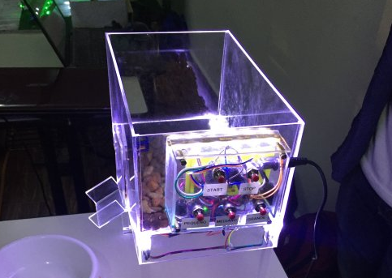
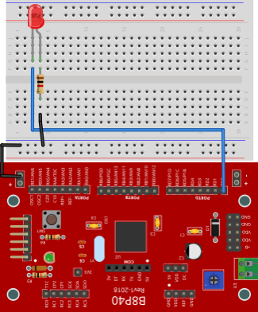
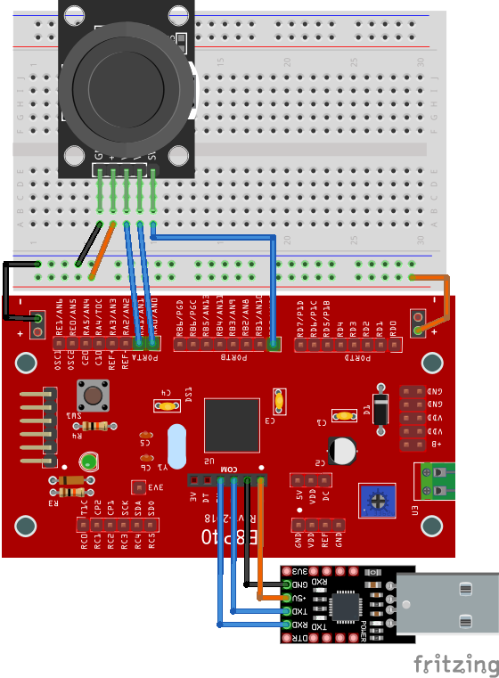
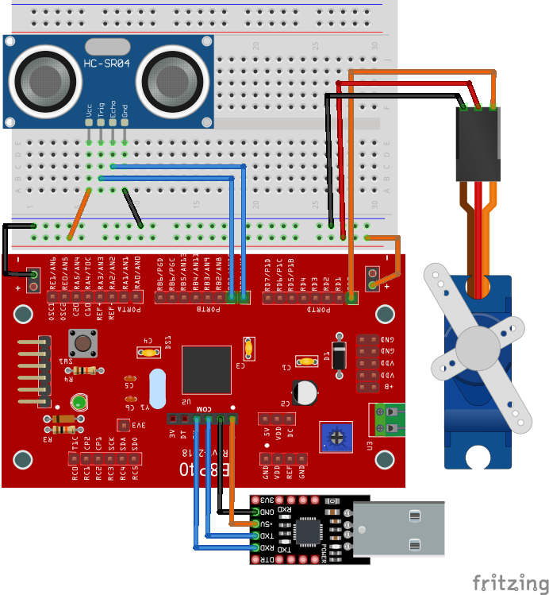
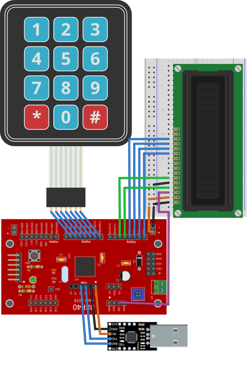

# MCU20 pablinza@me.com
Programacion de Microcontroladores PIC16F

  </img>

Carpeta con los proyectos generados por MPLABX utilizando el compilador XC8 para los modelos:
- PIC16F887 con oscilador interno 8MHz 
- PIC16F687 con oscilador interno 8MHz  
Los archivos con extension .c corresponden al codigo fuente de un programa o practica
Los archivos con extension .h y .c con mismo nombre, son procedimientos y funciones basicas
Los archivos con extension .hex representan el codigo de maquina generado para el PIC
Los archivos con extension .png corresponden a una imagen de esquema de circuito

Los proyectos se crearon con la version MPLABX 6.25 y el compilador XC8 2.50 version FREE
Practicas de Programacion para Microcontroladores PIC16F.

## Lista de practicas desarrolladas en la Materia
### - P01 - Destello de Luz Seciencial   [APPBASE]
  

  </img>

El cricuito que destella un led con tarea concurrente utilizando un temporizador, este codigo representa el programa base para los siguientes ejemplos.

### - P02 - Control de Trafico Vehicular [APTRAFFIC]

  </img>

Este circuito muestra como implementar un contrlador de trafico para dos fases, el cual incluye una entrada de mantenimiento. Los tiempos son programables

### - P03 - Monitor de Datos Serial ADC  [APMONITOR]

  </img>

Circuito que hace lectura de dos canales analogicos y uno digital del joystick, y cuyos valores se transmiten a un ordenador a travez del puerto serial.

### - P04 - Controlador para Servomotor  [APSERVO]

  </img>

Este circuito permite el control de un servomotor para la apertura de barra utilizando un detector de objetos por ultrasonido

### - P05 - Control de Acceso Autorizado [APKEYPAS]

  </img>

Circuito para el control de acceso autorizado, utilizando un teclado para ingresar la clave y un display que muestra el estado.

Adjunto el siguiente link que muestra como compilar estos ejemplos en MPLABX

Elaborado por Pablo Zarate Arancibia 
pablinza@me.com / pablinzte@gmail.com
Blog de contenido https://pablinza.blogspot.com
Canal Youtube http://www.youtube.com/@pablozarate7524
 
Facultad de Ciencias y Tecnologia, Santa Cruz - Bolivia

