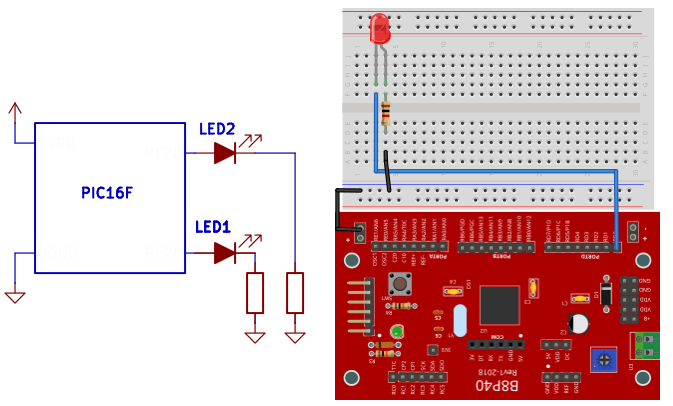

# B8P40 Microcontrolador PIC1&F887 pablinza@me.com
Descripcion de la Placa B8P40 para programacion del PIC16F

  </img>

Carpeta con los proyectos generados por MPLABX utilizando el compilador XC8 para los modelos:
- PIC16F887 con oscilador interno 8MHz 
- PIC16F687 con oscilador interno 8MHz  
Los archivos con extension .c corresponden al codigo fuente de un programa o practica
Los archivos con extension .h y .c con mismo nombre, son procedimientos y funciones basicas
Los archivos con extension .hex representan el codigo de maquina generado para el PIC
Los archivos con extension .png corresponden a una imagen de esquema de circuito

Los proyectos se crearon con la version MPLABX 6.25 y el compilador XC8 2.50 version FREE
Practicas de Programacion para Microcontroladores PIC16F.

## Lista de practicas desarrolladas en la Materia
### - P01 - Destello de Luz Seciencial   [APPBASE]
  

  </img>

El cricuito que destella un led con tarea concurrente utilizando un temporizador, este codigo representa el programa base para los siguientes ejemplos.

Circuito que hace lectura de dos canales analogicos y uno digital del joystick, y cuyos valores se transmiten a un ordenador a travez del puerto serial.

Adjunto el siguiente link que muestra como compilar estos ejemplos en MPLABX

Autor: Pablo Zarate, puedes contactarme a pablinza@me.com / pablinzte@gmail.com.   
Visita mi Blog  [Blog de Contenidos](https://pablinza.blogspot.com/).  
Visita mi Canal [Blog de Contenidos](http://www.youtube.com/@pablozarate7524)).  
Facultad de Ciencias y Tecnologia UEB - Ingenieria Electronica.  
Santa Cruz - Bolivia 
 
***********************

